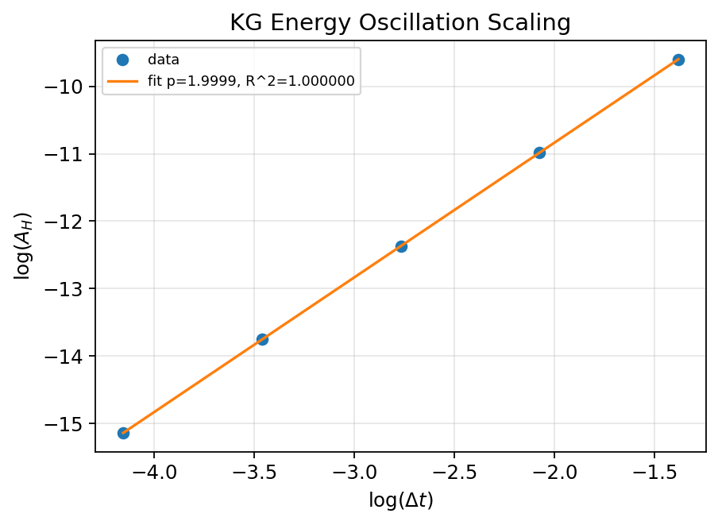

# KG J-only Energy Oscillation Scaling and Time-Reversal (QC)

> Author: Justin K. Lietz  
> Date: 2025-10-13  
> Commit: 66eb296  
>
> This research is protected under a dual-license to foster open academic  
> research while ensuring commercial applications are aligned with the project's ethical principles.  
> Commercial use requires citation and written permission from Justin K. Lietz.  
> See LICENSE file for full terms.  

## Introduction

The study validates the conservative limb of the linear Klein–Gordon (KG) discretization under a symplectic (Störmer–Verlet) time integrator on a periodic lattice. It measures how the discrete energy oscillation amplitude scales with the time step and checks strict time-reversal. This quality control (QC) establishes the KG integrator as a precise measuring instrument for subsequent metriplectic coupling.

Evaluation question: Does the energy oscillation amplitude scale as $A_H(\Delta t) \propto (\Delta t)^2$ with high linearity and is the scheme strictly time-reversible at machine precision?

Pinned artifact: /mnt/ironwolf/git/Prometheus_VDM/Derivation/code/outputs/figures/metriplectic/20251013_021321_kg_energy_osc_fit_KG-energy-osc-v1.png

## Research question

- Independent variables: time step $\Delta t$ sampled on a geometric ladder from $\Delta t\_\max$ to $\Delta t\_\max/2^4$, seeds (band-limited ICs across low/mid/high $k$-bands).
- Dependent variables: energy oscillation half-amplitude $A_H$, relative amplitude $A_H/\bar H$, and time-reversal error $e_{\mathrm{rev}} = \max\{\|\phi_\text{back}-\phi_0\|_\infty,\,\|\pi_\text{back}-\pi_0\|_\infty\}$.
- Estimator: $A_H = \tfrac12(\max_t H_d - \min_t H_d)$ with $H_d = \tfrac12\|\pi\|_2^2 + \tfrac12 c^2\|\nabla_h\phi\|_2^2 + \tfrac12 m^2\|\phi\|_2^2$. Multi-seed median aggregation per $\Delta t$ avoids resonance bias.
- Thresholds: slope $p\in[1.95,2.05]$, $R^2\ge 0.999$, $(A_H/\bar H)$ at smallest $\Delta t$ $\le 10^{-4}$, and $e_{\mathrm{rev}}\le 10^{-12}$.

## Background Information

- Model: linear KG on periodic 1D lattice, spectral gradient/Laplacian, parameters $c=1.0$, $m=0.5$.
- Scheme: Störmer–Verlet (second order, symplectic, time-reversible); energy oscillation at $\mathcal{O}(\Delta t^2)$ is the expected modified-equation effect.
- Stability control: discrete $\omega\_\max$ from actual spatial operator $\omega_k^2 = m^2 + c^2\,\lambda_k$; set $\Delta t\_\max = 0.8/\omega\_\max$.
- Mapping to gates: modified equation predicts $p\approx 2$; symplectic reversibility implies $e_{\mathrm{rev}}\approx 0$; small relative amplitude at fine $\Delta t$ is required for instrument precision.

## Variables

- Independent: $N=256$, $dx=1.0$; $\Delta t\in\{0.25148, 0.12574, 0.062871, 0.031435, 0.015718\}$ (computed); seeds per band $=2$; bands $=[1,8],[9,24],[25,48]$.
- Dependent: $A_H(\Delta t)$, $A_H/\bar H(\Delta t)$, $e_{\mathrm{rev}}$ (max over seeds).
- Controls: periodic BC; spectral operators; deterministic FFT plans; single-thread posture recommended; fixed seeds; checkpoints at steps [0,64,128,256,512].

## Equipment / Hardware

- Environment audit (from run): Python 3.13.5, NumPy 2.2.6; FFT plan: deterministic; thread envs unset (recorded). Linux host.
- Determinism receipts: checkpoint buffer hashes logged in the JSON sidecar at fixed checkpoints (0, 64, 128, 256, 512) for one representative seed per $\Delta t$.
- Provenance: commit a9e1c6c; script Derivation/code/physics/metriplectic/run_kg_energy_oscillation.py; spec specs/kg_energy_osc.v1.json.
- Measurement limits: fp64 roundoff; FFT real/imag path determinism; cross-architecture ULP-level tolerance.

## Methods / Procedure

- Discretization and solver: spectral spatial operators; Störmer–Verlet time step; steps = 1024.
- ICs: band-limited sinusoids with random phases within bands; normalization to fixed amplitude; multiple seeds per band.
- Post-processing: compute $H_d(t)$ per step; aggregate medians of $A_H$ and $A_H/\bar H$ across seeds at each $\Delta t$; fit $\log A_H$ vs $\log \Delta t$.
- Integrity: approval-gated tag KG-energy-osc-v1; JSON schema validation; results DB logging; artifacts PNG/CSV/JSON with common IO helper.

## Results / Data

- Fit slope: $p = 1.999885$; coefficient of determination $R^2 = 0.99999999937$.
- Time-reversal error: $e_{\mathrm{rev}} = 2.93\times 10^{-16}$.
- Relative amplitude at smallest $\Delta t$: $1.346\times 10^{-5}$.
- Gate status: PASS for all thresholds.

Figure 1. KG energy-oscillation scaling: log–log fit of $A_H$ vs $\Delta t$ with slope $p\approx 2.000$ and $R^2\approx 1.0$. Artifact (PNG): /mnt/ironwolf/git/Prometheus_VDM/Derivation/code/outputs/figures/metriplectic/20251013_021321_kg_energy_osc_fit_KG-energy-osc-v1.png. Sidecars (same slug family):

- CSV: /mnt/ironwolf/git/Prometheus_VDM/Derivation/code/outputs/logs/metriplectic/20251013_021322_kg_energy_osc_fit_KG-energy-osc-v1.csv
- JSON summary (includes determinism receipts): /mnt/ironwolf/git/Prometheus_VDM/Derivation/code/outputs/logs/metriplectic/20251013_021322_kg_energy_osc_fit_KG-energy-osc-v1.json

Seed bands and commit a9e1c6c.

Sample data points (median over seeds per $\Delta t$):

- $\Delta t=0.25148$: $A_H=6.7828\times 10^{-5}$, $A_H/\bar H=3.4565\times 10^{-3}$
- $\Delta t=0.12574$: $A_H=1.6958\times 10^{-5}$, $A_H/\bar H=8.6186\times 10^{-4}$
- $\Delta t=0.062871$: $A_H=4.2395\times 10^{-6}$, $A_H/\bar H=2.1532\times 10^{-4}$
- $\Delta t=0.031435$: $A_H=1.0601\times 10^{-6}$, $A_H/\bar H=5.3834\times 10^{-5}$
- $\Delta t=0.015718$: $A_H=2.6503\times 10^{-7}$, $A_H/\bar H=1.3458\times 10^{-5}$

## IX. Discussion / Analysis

The results align with the modified-equation prediction for symplectic integrators: the discrete energy oscillates with amplitude $\propto (\Delta t)^2$. The near-perfect linearity in log–log space and the machine-precision reversibility confirm that the KG integrator is a stable and precise baseline. The small relative amplitude at fine $\Delta t$ indicates the measurement instrument has low intrinsic noise, supporting downstream metriplectic coupling and routing experiments. Potential residuals arise from spectral truncation and phase interactions within band-limited seeds; medians mitigate resonance.

## Conclusions

- Aim restated: certify KG J-only integrator as an accurate measuring instrument via $A_H(\Delta t)$ scaling and time-reversal.
- Outcome: thresholds met with $p\approx 2.000$, $R^2\approx 1.0$, $e_{\mathrm{rev}}\approx 3\times 10^{-16}$, and relative amplitude $\le 10^{-4}$ at finest $\Delta t$.
- Interpretation: numerical evidence supports the expected second-order behavior and exact reversibility of Störmer–Verlet on the linear KG system.
- Next gates: run KG-noether-v1 (already PROVEN) as a cross-check on this grid; proceed to Passive Thermodynamic Routing v2 with strict gates; determinism receipts (checkpoint buffer hashes) are now logged for identity audits.

## References / Works Cited

- Hairer, Lubich, Wanner. Geometric Numerical Integration.
- Leimkuhler, Reich. Simulating Hamiltonian Dynamics.
- Morrison, P. J. A paradigm for joined Hamiltonian and dissipative systems. Physica D (1998).
