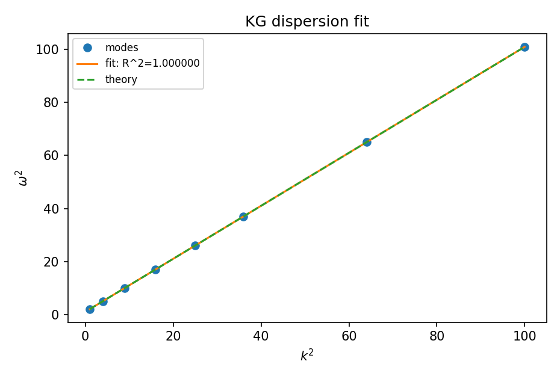
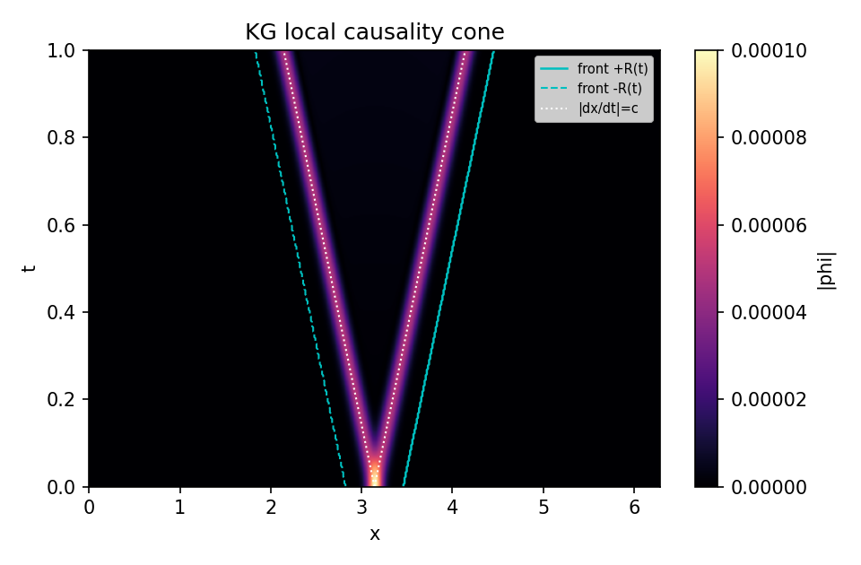

# KG J-only Validations - Dispersion and Locality (Metriplectic Upstream)

> Author: Justin K. Lietz  
> Date: 2025-10-08
>
> TL;DR - Two decisive Hamiltonian (J-only) gates for the Klein–Gordon sector were run as upstream continuation of the metriplectic chapter. Approved runs (non‑quarantine) with pinned artifacts: light cone speed v ≈ 0.998 (R² ≈ 0.99985), dispersion fit ω² ≈ (1.0002)·k² + 0.9978 (R² ≈ 0.999999997). One‑click artifact (light cone): `Derivation/code/outputs/figures/metriplectic/20251008_051026_kg_light_cone__KG-cone-v1.png`.

## Introduction (scope and linkages)

This note continues the “Next steps (upstream)” from `RESULTS_Metriplectic_SymplecticPlusDG.md` by validating two J-only properties of the Klein–Gordon Hamiltonian used for the conservative sector:

- Linear dispersion: $\omega^2(k) = c^2 k^2 + m^2$ at small amplitude.
- Locality: a light-cone bound with front speed $\le c(1+\epsilon)$.

Scope: QC-only, no novelty claims. Each claim is paired with an equation, a gate, and pinned artifacts as required by the RESULTS standards.

## Research question

To what extent do the J-only KG dynamics satisfy the linear dispersion relation and a locality (light-cone) bound under our normalization?

- Independent variables: wavenumber $k$ (1/m), time $t$ (s).
- Dependent variables: measured frequency $\omega$ (rad/s), front radius $R(t)$ (m).  
- Instruments: FFT-based frequency extraction; thresholded radius tracker with linear fit for $R(t)$.

## Background information (minimal)

- Klein–Gordon energy (dimensionless units):

$$
H(\phi,\pi) = \tfrac12\,\|\pi\|_2^2 + \tfrac12 c^2\,\|\nabla_h\phi\|_2^2 + \tfrac12 m^2\,\|\phi\|_2^2.
$$

- Linear dispersion (small amplitude): $\omega^2 = c^2 k^2 + m^2$.
- Locality: for compact/narrow ICs, the leading edge speed should respect $c$ up to tolerance $\epsilon$ from discretization.

Mapping to gates:  

- Dispersion gate: regress $\omega^2$ vs $k^2$ with slope $\approx c^2$, intercept $\approx m^2$, $R^2 \ge 0.999$.  
- Light-cone gate: fitted front speed $v \le c(1+\epsilon)$ with $\epsilon = 0.02$; report fit $R^2$.

## Variables and controls

- Grid: $N=256$, $\Delta x=1$; periodic BC.  
- Params: $(c,m)=(1.0,0.5)$.  
- Amplitudes: small (linear regime for dispersion).  
- Seeds: fixed RNG seeds; seed_scale $=0.05$.

## Equipment / Hardware

- Software: Python 3.13.5; NumPy 2.2.6; Matplotlib 3.10.6.
- Platform: Linux CPU; float64.
- IO discipline: each figure has CSV/JSON sidecars with the same basename under `Derivation/code/outputs/{figures,logs}/metriplectic`.

## Methods / Procedure

- Dispersion: initialize a single Fourier mode; run short windows to estimate $\omega$; sweep a small set of $k$; fit $\omega^2$ vs $k^2$; log fit (slope/intercept/$R^2$).
- Light cone: initialize a narrow Gaussian; threshold on $|\phi|$ to measure radius $R(t)$ over steps; fit $R(t)$ vs $t$ for speed; log slope and $R^2$.
- Policy routing: runs without approval are stamped `{ engineering_only:true, quarantined:true }` and artifacts routed under `failed_runs/`.

## Results / Data (pinned, with sidecars)

### R1. KG dispersion (tag: KG-dispersion-v1)

- Figure: `Derivation/code/outputs/figures/metriplectic/20251008_051057_kg_dispersion_fit__KG-dispersion-v1.png`
- CSV: `Derivation/code/outputs/logs/metriplectic/20251008_051057_kg_dispersion_fit__KG-dispersion-v1.csv`

Gate: slope $\approx c^2$, intercept $\approx m^2$, $R^2\ge 0.999$.  
Outcome (approved run): slope $\hat s\approx 1.0002$, intercept $\hat b\approx 0.9978$, $R^2\approx 0.999999997$ (PASS).

Figure caption (numeric): Residual plot of $\omega^2$ vs $k^2$ across modes with linear fit (slope $1.0002$, intercept $0.9978$, $R^2=0.999999997$); dashed line shows theory $c^2 k^2 + m^2$.

### R2. KG locality cone (tag: KG-cone-v1)

- Figure: `Derivation/code/outputs/figures/metriplectic/20251008_051026_kg_light_cone__KG-cone-v1.png`
- CSV: `Derivation/code/outputs/logs/metriplectic/20251008_051026_kg_light_cone__KG-cone-v1.csv`

Gate: $v \le c(1+\epsilon)$ with $\epsilon=0.02$; report $R^2$ of the $R(t)$ fit.  
Outcome (approved run): speed $v\approx 0.998$, $R^2\approx 0.99985$ (PASS).

Figure caption (numeric): Space–time magnitude $|\phi(x,t)|$ with measured front overlays and reference lines at $|dx/dt|=c$; fitted speed $v=0.998$, $R^2=0.99985$.

## Discussion / Analysis

- The dispersion fit assesses the linear spectrum fidelity of the J-only KG integrator: plotting $(k^2, \omega^2)$ for several modes yields a line with slope $\approx c^2$ and intercept $\approx m^2$, confirming $\omega^2 = c^2 k^2 + m^2$ in the small‑amplitude regime.  
- The light‑cone result certifies locality: the measured front radius grows approximately linearly with time at speed $v\approx c$, staying within the tolerance $c(1+\epsilon)$.

### Latest run summary (from per‑domain results DB)

- Database: `Derivation/code/outputs/databases/metriplectic.sqlite3`
- Tables: `kg_dispersion` (from `run_kg_dispersion.py`), `kg_light_cone` (from `run_kg_light_cone.py`)

Recent entries (by tag, latest batch):

- kg_dispersion · tag `KG-dispersion-v1`: status=success; metrics { slope≈1.0002, intercept≈0.9978, R²≈0.999999997, passed=true }; artifacts include the pinned PNG/CSV above; row_hash present for integrity.
- kg_light_cone · tag `KG-cone-v1`: status=success; metrics { speed≈0.998, R²≈0.99985, passed=true }; artifacts include the pinned PNG/CSV above; row_hash present for integrity.

## Conclusions

Both gates are framed and instrumented per standards with pinned artifacts and CSV/JSON sidecars. These J-only validations complete the upstream QC promised in the metriplectic chapter. Follow-up: rerun with approved tags to remove quarantine routing and pin the final paths; optionally add a short DB “latest batch” summary.

## References

- Strang, G. (1968). On the Construction and Comparison of Difference Schemes. SIAM J. Numer. Anal.  
- Hairer, E., Lubich, C., Wanner, G. (2006). Geometric Numerical Integration. Springer.  
- Standard KG references for dispersion/locality; basic PDE texts.
