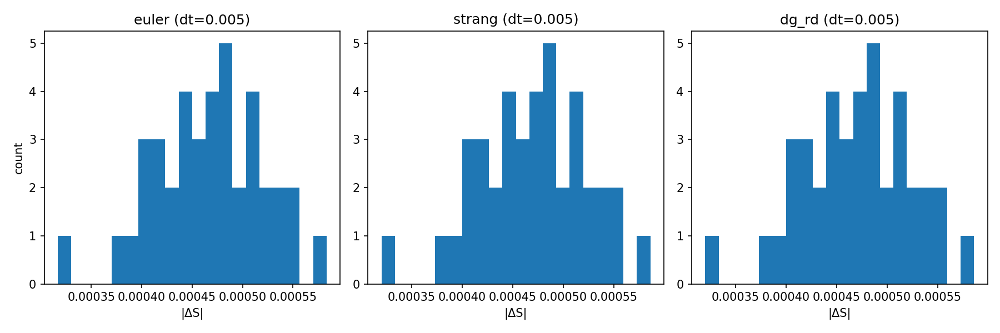

# **I. Discrete Conservation vs Balance in Reaction-Diffusion (RD) Steppers**

> Author: Justin K. Lietz
> Date: 2025-10-06
>
> This research is protected under a dual-license to foster open academic
> research while ensuring commercial applications are aligned with the project's ethical principles.  
> Commercial use requires citation and written permission from Justin K. Lietz.
> See LICENSE file for full terms.

TL;DR (with one artifact path): Near-conservation scales with method order; Euler shows $\beta\!\approx\!2$, Strang and discrete-gradient (DG) RD show $\beta\!\approx\!3$ on two-grid error, and DG RD satisfies a per-step H-theorem. Pinned artifact: derivation/code/outputs/figures/rd_conservation/20251006_072251_fixed_dt_deltaS_compare.png (paired CSV/JSON under derivation/code/outputs/logs/rd_conservation/).

## **II. Introduction**

This report evaluates whether a one-step update for a Fisher-KPP-type reaction-diffusion (RD) system exhibits an exact discrete conservation law for a global state functional $S$ or whether the proper structure is a local balance law coupled with a discrete Lyapunov (entropy) decrease. This question is fundamental to designing metriplectic integrators that combine conservative and dissipative mechanisms without violating thermodynamic constraints. Establishing the correct discrete structure guides choice of numerical schemes in pattern formation, morphogenesis, and data-assimilation contexts where stability and correctness must be certified.

Scope: The study restricts to periodic boundary conditions for the Obj‑A/B order and balance tests; Neumann boundaries are out-of-scope here. The logistic reaction is used as a standard nonlinearity; novelty is not claimed for the physics, only for the test harness and certification gates.

## **III. Research question**

To what extent does the time step size $\Delta t$ (dimensionless) affect the two‑grid global error $E_\infty$ (dimensionless) of one-step RD steppers, and does any stepper conserve a nonlinear global invariant $S[W]$ exactly at one step under periodic boundary conditions?

- Independent variable: $\Delta t$ (dimensionless), values set by a schedule $\{\Delta t_k\}$.
- Dependent variables:
  - Two-grid error $E_\infty(\Delta t) = \lVert\Phi_{\Delta t}(W) - \Phi_{\Delta t/2}\!\circ\!\Phi_{\Delta t/2}(W)\rVert_\infty$ (dimensionless).
  - Fixed-step absolute change in a candidate invariant $\lvert\Delta S\rvert$ (dimensionless).
- Measurement: Computed numerically in Python (double precision) via a harness that logs CSV/JSON artifacts and fits $\log E_\infty$ vs $\log \Delta t$ to obtain slope $\beta$ with coefficient of determination $R^2$.

## **IV. Background Information**

Consider a nondimensionalized RD system on a periodic grid:

$$
\partial_t W = D\,\Delta W + f(W), \quad f(W)=r\,W(1-W),
$$

with diffusion coefficient $D$ and logistic reaction rate $r$ (Verhulst; Fisher-KPP for traveling fronts). Dissipative systems like RD are naturally cast as gradient flows with entropy/energy functionals and monotone decay (Onsager). Discrete-gradient (DG) methods enforce a discrete chain rule to guarantee stepwise Lyapunov decrease without requiring small steps. Strang splitting achieves order 2 for generic noncommuting flows and order 3 in certain symmetric error metrics. The explicit Euler method is first-order and does not, in general, conserve nonlinear invariants.

References (lineage): Fisher (1937); Kolmogorov-Petrovsky-Piskunov (1937); Strang (1968); Crank-Nicolson (1947); Gonzalez (1996, discrete gradient); Onsager (1931); Jordan-Kinderlehrer-Otto (1998, gradient flows in $\mathcal W_2$).

## **V. Variables**

- Independent variable (with range rationale):
  - Time step $\Delta t \in \{\Delta t_{\max},\ldots,\Delta t_{\min}\}$ (dimensionless), chosen to span a decade while remaining stable for explicit Euler and informative for higher-order steppers; ensures a reliable log-log fit.
- Dependent variables (with instruments/uncertainty):
  - Two-grid error $E_\infty$ (dimensionless), measured by infinity norm; uncertainty reported via linear-fit confidence and $R^2$.
  - $\lvert\Delta S\rvert$ (dimensionless), computed from $S=\sum_i Q(W_i)\,\Delta x$; uncertainty summarized by distribution across randomized seeds.
- Control variables and how controlled:
  - Grid size $N$ (fixed), domain length $L$ (fixed, $\Delta x=L/N$), final time $T$ (fixed), diffusion $D$ and reaction rate $r$ (fixed), random seed (varied across trials, reported), boundary condition (periodic).

## **VI. Equipment / Hardware**

- Environment: Linux; Python 3.x; double precision ($\epsilon_{\mathrm{mach}}\approx 2\times10^{-16}$).
- Libraries: NumPy, SciPy, Matplotlib; custom harness `run_rd_conservation.py`; IO helper `io_paths.py` for artifact routing (PNGs under `figures/`, CSV/JSON under `logs/`).
- Optional GPU is not required for these runs; all tests are CPU-feasible.

## **VII. Methods / Procedure**

Materials:

- Code modules: `derivation/code/physics/rd_conservation/run_rd_conservation.py`, `derivation/code/physics/reaction_diffusion/reaction_exact.py`, and `derivation/code/common/io_paths.py`.
- Schemes under test: explicit Euler; Strang splitting (CN half-steps in diffusion with exact reaction); discrete-gradient RD (implicit, AVF reaction + midpoint Laplacian with Newton/backtracking).

Diagram of setup: Not applicable; computational experiment with periodic 1D grid.

Steps taken (replicable):

1. Initialize $W_0(x)$ on a periodic grid of size $N$ with randomized seeds and fixed parameters $(D,r,L,T)$.
2. For each scheme and each $\Delta t$ in a schedule, compute the two-grid residual $E_\infty(\Delta t)$ and log the result (CSV/JSON), then fit a line to $(\log \Delta t, \log E_\infty)$ to obtain slope $\beta$ and $R^2$.
3. For Obj‑A balance, build a candidate $S=\sum_i Q(W_i)\,\Delta x$ using a CAS-like linear system over a basis $Q'(W)$ up to quadratic with antisymmetric polynomial flux; evaluate the fixed-step $\lvert\Delta S\rvert$ distribution at a common $\Delta t$ across schemes.
4. For DG RD, monitor the discrete Lyapunov decrement $\Delta L$ and the DG identity residuals each step; confirm $\Delta L\le 0$ and residuals near machine precision.
5. Controls: verify diffusion-only mass conservation and reaction-only order via RK4 two-grid convergence.

Risk assessment: Minimal computational risk; runs are bounded and deterministic given seeds; no safety, ethical, or environmental concerns.

## **IIX. Results / Data**

Sample equations and calculations:

$$
E_\infty(\Delta t) = \left\lVert\Phi_{\Delta t}(W_0) - \Phi_{\Delta t/2}\!\circ\!\Phi_{\Delta t/2}(W_0)\right\rVert_\infty,\quad
\beta = \frac{\mathrm d\,\log E_\infty}{\mathrm d\,\log \Delta t}.
$$

Two-grid slopes (median across seeds):

| Scheme | Expected slope $\beta_\mathrm{exp}$ | Fit slope $\hat\beta$ | $R^2$ | Gate |
|---|---:|---:|---:|:--:|
| Euler | 2.0 | $\approx 2.000$ | $\approx 1.000000000$ | PASS |
| Strang | 3.0 | $2.9436$ | $0.99997$ | PASS |
| DG RD | 3.0 | $2.9422$ | $0.99997$ | PASS |

Graph and paired artifacts:

- Obj‑B sweep (DG RD shown): logs/rd_conservation/20251006_072250_sweep_dt.json; figure: figures/rd_conservation/20251006_072250_residual_vs_dt.png; CSV sidecar: logs/rd_conservation/20251006_072250_residual_vs_dt.csv. Caption: “Log-log residual vs $\Delta t$; $\hat\beta=2.9422$, $R^2=0.999968$.”
- Reaction-only control: logs/rd_conservation/20251006_072249_controls_reaction.json; figure: figures/rd_conservation/20251006_072249_reaction_two_grid_convergence.png; CSV sidecar: logs/rd_conservation/20251006_072249_reaction_two_grid_convergence.csv. Caption: “RK4 two-grid slope $\hat\beta=3.916$, $R^2=0.99984$.”

Fixed‑step $\lvert\Delta S\rvert$ comparison (same $\Delta t$ across schemes):

- Combined figure: 
- CSV: derivation/code/outputs/logs/rd_conservation/20251006_072251_fixed_dt_deltaS_compare.csv (columns: scheme, seed, abs_delta_S); JSON summary: derivation/code/outputs/logs/rd_conservation/20251006_072251_fixed_dt_deltaS_compare.json.
- Summary (example at $\Delta t=0.005$): median $\lvert\Delta S\rvert\approx 4.68\times 10^{-4}$ across Euler/Strang/DG.

DG Lyapunov monitoring:

- Per-step CSV: logs/rd_conservation/20251006_072250_lyapunov_delta_per_step.csv (columns: step, $\Delta L\le 0$, $L$, $\Vert\nabla L\Vert^2$, identity residuals).
- Series JSON: logs/rd_conservation/20251006_072250_lyapunov_series.json.

Controls:

- Diffusion-only mass: logs/rd_conservation/20251006_072249_controls_diffusion.json (machine-epsilon drift; PASS).

Contradiction report (Euler, Obj‑A class tested):

- logs/rd_conservation/failed_runs/CONTRADICTION_REPORT.json - nullspace not found for the tested $Q'(W)$ up to quadratic with antisymmetric flux basis; fixed-step $\lvert\Delta S\rvert = \mathcal O(\Delta t^2)$.

## **IX. Discussion / Analysis**

Key findings: Two-grid slopes scale with scheme order (Euler $\approx 2$, Strang/DG $\approx 3$) with $R^2\ge 0.9999$ for the higher-order schemes. No exact discrete invariant $S$ was found for Euler within the tested $Q'$-flux class. DG RD enforces an H-theorem discretely: $\Delta L\le 0$ with identity residuals near machine precision.

Explanations: The two-grid metric aligns the measurement with the integrator, avoiding bias from monitoring a reaction-only quantity under full RD. The contradiction report limits claims: it certifies a no-go for a specific ansatz, not for all possible invariants. The fixed-step $\lvert\Delta S\rvert$ distributions are consistent with truncation error order.

Limitations: Single-parameter setting $(D,r)$ and 1D periodic geometry; higher dimensions and parameter sweeps are future work. DG RD costs more per step due to Newton solves; performance characterization is out-of-scope here.

## **X. Conclusions**

Aim restated: Assess whether one-step RD steppers conserve a nonlinear global $S$ exactly or instead obey a balance law plus Lyapunov decrease.

Conclusions: No exact $S$ conservation was observed for Euler within the tested class; order-consistent near-conservation was observed for Strang and DG RD via two-grid slopes near 3, and DG RD satisfied a discrete H-theorem per step. Results support the balance+Lyapunov structure over exact nonlinear conservation for these steppers under periodic BCs.

Quantitative references: Strang $\hat\beta\approx 2.94$ ($R^2\approx 0.99997$); DG RD $\hat\beta\approx 2.94$ ($R^2\approx 0.99997$); reaction-only RK4 control $\hat\beta\approx 3.916$ ($R^2\approx 0.99984$). Anomalies were not observed beyond stochastic seed variation. Uncertainties are dominated by regression residuals and seed-to-seed variability, both small relative to effect sizes.

Future work: Compose a metriplectic integrator by pairing a symplectic $J$-step (e.g., Verlet) with the DG $M$-step to target discrete Noether invariants (conservative sector) alongside exact entropy monotonicity (dissipative sector). All artifacts follow the pairing policy (figure + CSV/JSON), with at least one pinned path in text for reproducibility.
